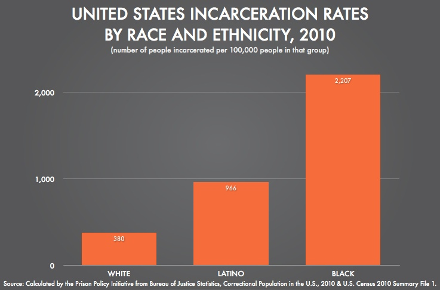
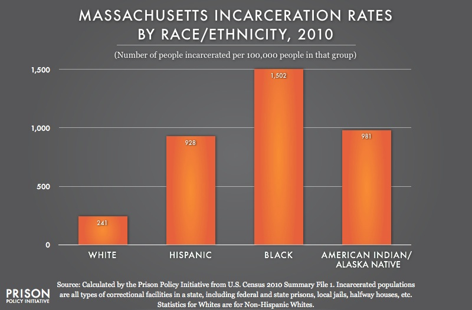

### The belief of an existant inequality of how law enforcement interact with different social groups (particularly African Americans versus Caucasians) is a well documented phenomenon that has long been a topic for national discussion especially after events such as those in Ferguson, Missouri. We attempted to find inequalities in law enforcement interactions with different social groups by examining records of police stops in the city of Boston from 2011 to 2015
***
## **Findings**
### We found that African-Americans made up 58.6% of police stops in the city of Boston while police stops of whites made up 22.8% of all police stops in the city of Boston. These percentages do not accurately represent the actual population of Boston, however. Whites make up a much larger percentage of the Boston population (around 54%) than blacks (around 24%) but the data shows that it is much more likely for blacks to be stopped by police than it is for whites to be stopped by police. This supports the notion that law enforcement interact with different social groups unequally.
***
## **Significance**
### These findings are particularly disturbing when considering that these findings are in line with national trends in incarceration. In the United States African-Americans are much more likely to be incarcerated than whites.

### Narrowing our focus to only the state of Massachusetts we can see that the same racial inequalities regarding incarceration persist:

### Our findings of racial inequalities in police stops in the city of Boston reinforce the idea that African-Americans are overrepresented in prisons not only in the state of Massachusetts but also in the United States as a whole.
#### Find more information about US incarceration rates [here](http://www.prisonpolicy.org/reports/rates.html)
***
## **Other Trends**
### Other trends we found were that younger people within the ages of 18-24 were the most likely to be stopped by the police as they comprised 37.1% of total police stops in Boston and that men were much more likely to be stopped by police as men comprised 88.2% of total police stops in Boston despite there being around an equal percentage of men and women in the city of Boston (around 52% of Boston population are women).
***
## **Notes**
### It is worth noting that 3827 of those who were stopped did not define an age, 237 of those who were stopped did not define a sex, and 6647 of those who were stopped did not define a race. Population estimates used based on 2010 US Census
***
## **Works Cited**
### Breaking Down Mass Incarceration in the 2010 Census: State-by-State Incarceration Rates by Race/Ethnicity." Breaking Down Mass Incarceration in the 2010 Census. N.p., n.d. Web. 10 Mar. 2016.
### "Population Estimates, July 1, 2015, (V2015)." QuickFacts. N.p., n.d. Web. 10 Mar. 2016.
